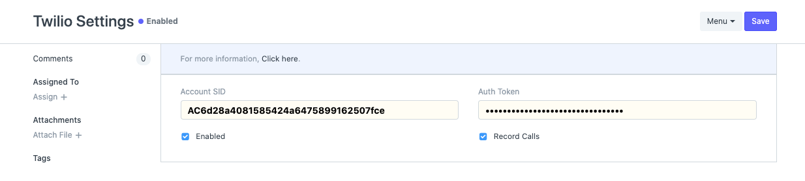
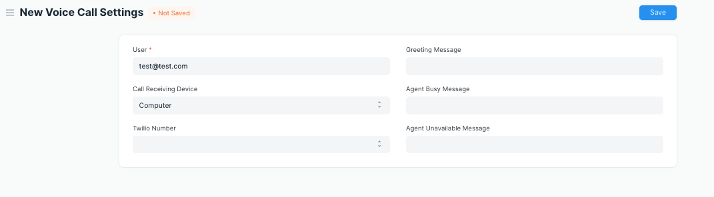
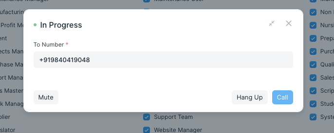
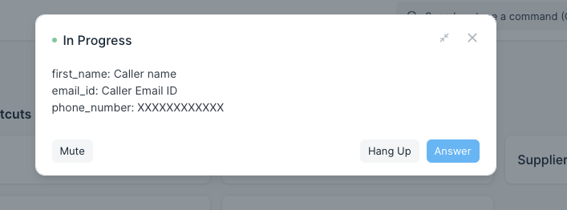
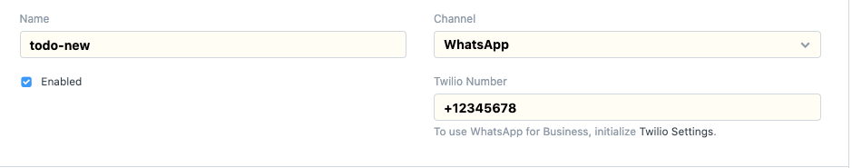

# Twilio Integration

Custom Frappe Application for Twilio Integration

## Features
- Users can make outgoing voice calls by clicking at the phone icon that shows up next to the phone number.
- Users can receive Incoming calls either in Phone or in browser.
- Users can send notifications through whatsapp.

### Authorize twilio
To authorise Twilio integration go to Twilio Settings Doctype and provide `Account SID` and `Auth Token`. Make sure Twilio Settings are enabled to use Twilio in the system.

<kbd></kbd>

### Voice Call

Every user(Agent) needs to have voice call settings to make or receive calls. User can use Twilio features once `Voice Call Settings` created.

In voice call settings
1. choose the `Call Receiving Device` as `Computer` to receive calls in the browser or `Phone` to receive calls in your Phone(Make sure that `Mobile No` is configured in `My Settings` section to receive calls in your phone).
2. Choose your twilio number from `Twilio Number` dropdown field. This is going to be your twilio communication number.

<kbd></kbd>

#### Outgoing Calls

Once the user clicks the phone icon next to the phone number, the user will see a phone popup with a call button. Make sure that area code is included in the phone number(ex: +91) before using the call button to make outgoing calls.

<kbd></kbd>

#### Incoming Calls

When an incoming call comes, the call will be redirected to phone or to browser depending on user voice call Settings. Here is how it looks when call comes to browser.

<kbd></kbd>

### WhatsApp message

Users can send notifications through WhatsApp channel. While creating/editing a notification please Select Channel as `WhatsApp` and Twilio number from dropdown if you want to send whatsapp notification.

<kbd></kbd>


## Development

### Pre-requisites
- [ERPNext](https://docs.erpnext.com/docs/user/manual/en/introduction/getting-started-with-erpnext#4-install-erpnext-on-your-unixlinuxmac-machine
)
- Twilio account (More details from `Configure Twilio` section)

### Configure Twilio
* You need to create a [new project](https://www.twilio.com/console/projects/create)  in [Twilio account](https://www.twilio.com/) to use communication features like whatsapp, voice calls etc through ERPNext.

#### Twilio For Voice Calls
* From your Twilio console you can go to a [programmable voice](https://www.twilio.com/console/voice/dashboard) section and get a Twilio number to use for calls(make sure that the number is voice capable).
* Create a [TwiML App](https://www.twilio.com/console/voice/twiml/apps/create) by passing voice request url as `you_project_domain_name/api/method/twilio_integration.twilio_integration.doctype.twilio_settings.twilio_settings.voice` . Use `ngrok` to get  public domain for your project in case it is running locally.

#### Twilio For Whatsapp
* From your Twilio console you can go to a [Programmable Messaging](https://www.twilio.com/console/sms/dashboard) section and get a Twilio number to use for whatsapp.


### How To Setup
Once you have created a site with ERPNext app installed, you can download and install twilio-integration app using

```
bench get-app https://github.com/frappe/twilio-integration.git
bench --site site_name install-app twilio_integration
```

Use `bench start` command to run the project.

#### Configure Twilio Settings Through Project's Admin Interface
* For Whatsapp communication you need to set `Account SID` and `Auth Token` in `Twilio Settings`(You can get those from Twilio console).
* For calls you need to pass `TwiML SID`(Get it from TwiML app you have created) and `Outgoing Voice Medium` along with `Account SID` and `Auth Token` in `Twilio Settings`
* Make sure that you enabled twilio by clicking `Enabled` checkbox in settings.

NOTE: While creating a new `communication medium` for `Outgoing Voice Medium` pass twilio number(including area code(ex:+91)) as Name, `Twilio` as communication channel and `Voice` as Communication Medium Type.


#### License

MIT

